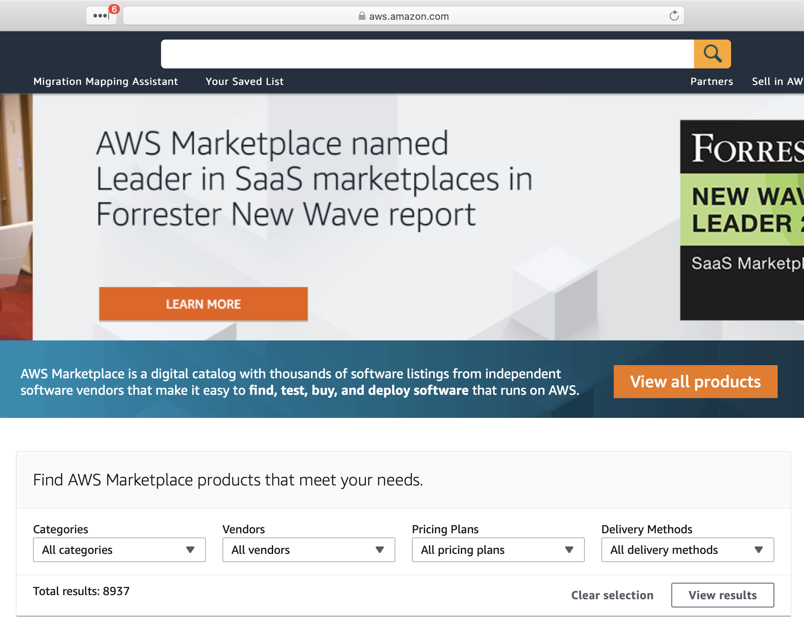
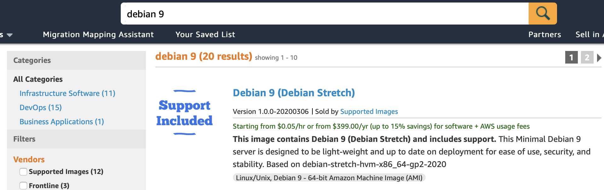
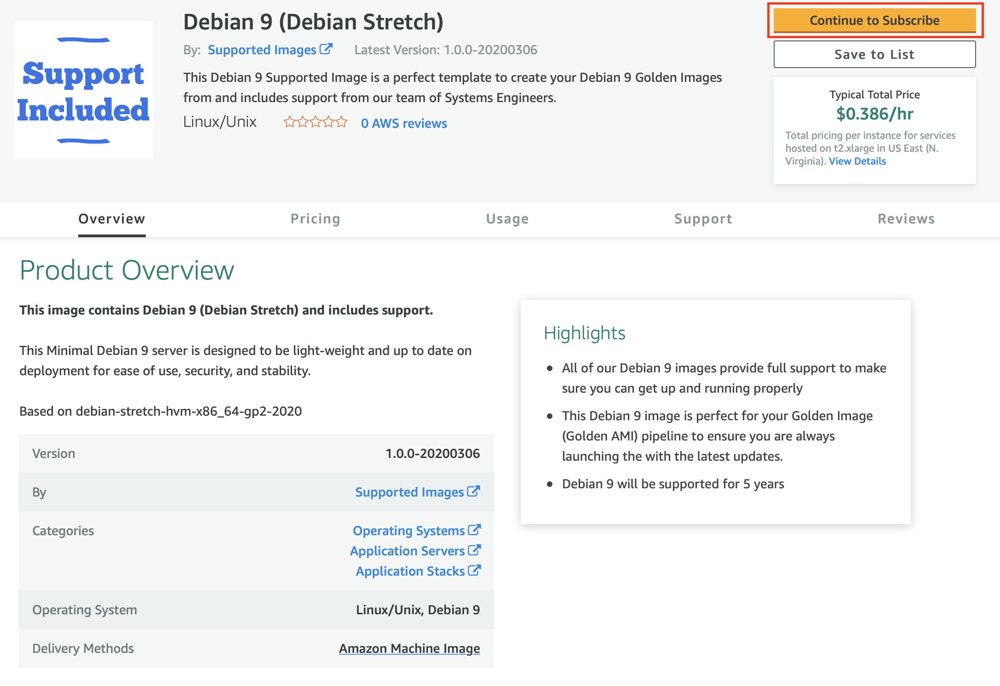
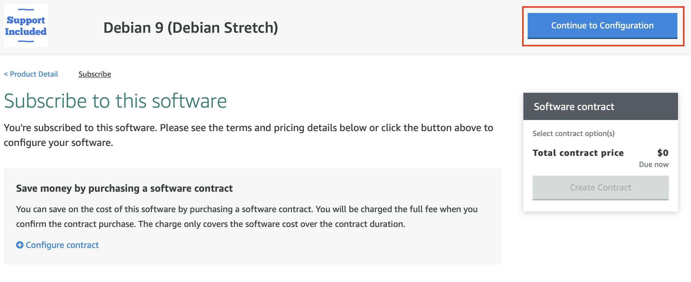
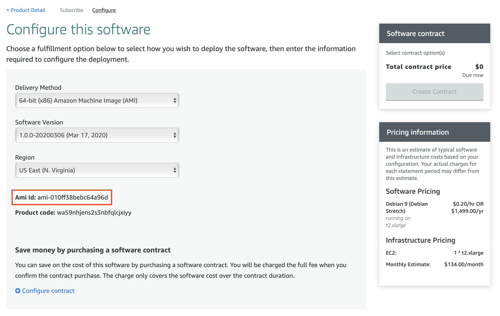
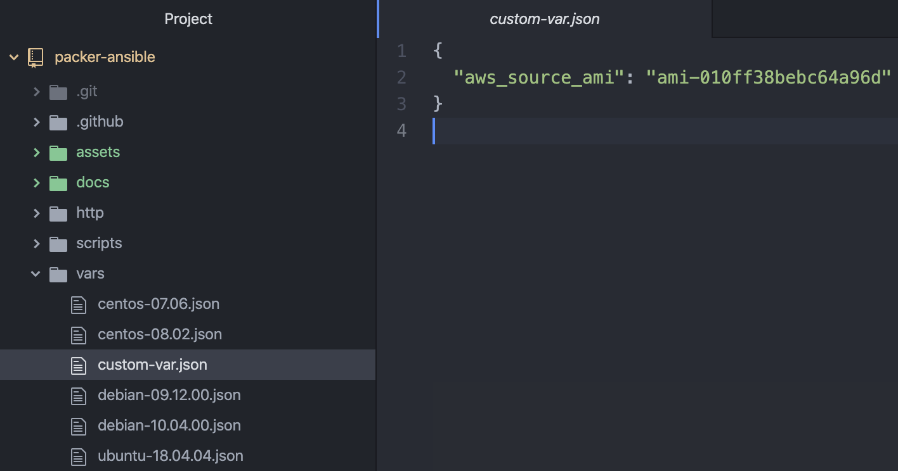

# Setup for AWS Marketplace images

To utilize AWS Marketplace images in packer, you must first subscribe to the desired image. After subscribing, you will be able to retrieve your AMI image id and insert that into the custom-var.json for it to be used in JSON. The default images used in this repository are community images.

1. Go to AWS Marketplace
1. Find desired image
1. Subscribe to the image
1. Grab image ID
1. Add to custom-var.json

## Go to AWS Marketplace

The AWS marketplace can be found [here](https://aws.amazon.com/marketplace).

## Find desired image

Search for your desired images, for this example, we are using Debian 9.

## Subscribe to the image

Subscribe to the image

Click on "Continue to Configuration"

## Grab image ID

Copy the AMI ID. Do note that you would not be able to use this image ID if you are not first subscribed to the image.

## Add to custom-var.json

Add the AMI ID to the custom-var.json

Now you are ready to go and create your own AMI, which is based on a AWS marketplace image
