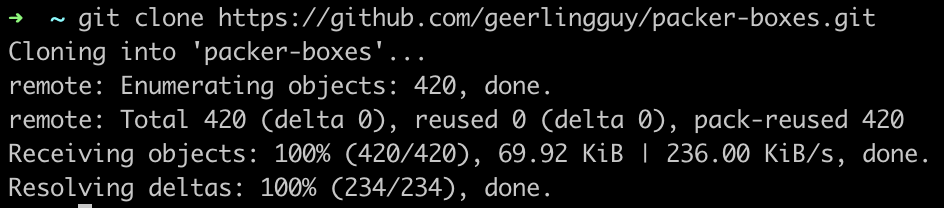
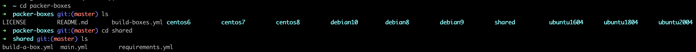
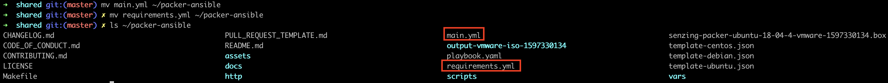
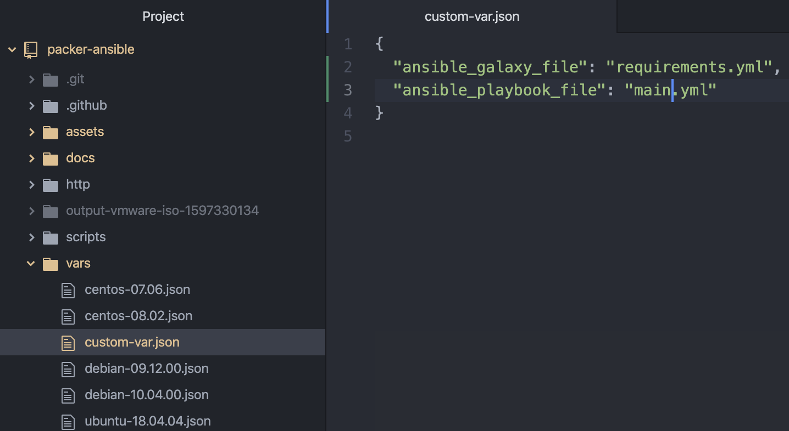

# How to setup Ansible Playbooks

To illustrate the power of Ansible playbooks and Ansible Galaxy, this demo will show you how Ansible Playbooks can be setup in 3 easy steps. This demo will use a template ansible playbook provided by [geerlingguy](https://github.com/geerlingguy/packer-boxes).

1. Download the Ansible playbook
1. Place into packer-ansible folder
1. Update custom-var.json

## Download the Ansible playbook

Firstly, clone the repository.

## Place into packer-ansible folder

Next, go to the shared folder.

Copy the main.yml and requirements.yml file to the packer-ansible folder.

## Update custom-var.json

Lastly, update custom-var.json with the new files.

Now you are ready to create an image that has been configured with your ansible playbook. On how to build images, do refer to our [centos](https://github.com/Senzing/packer-ansible/tree/issue-4.chia#build-using-template-centos), [debian](https://github.com/Senzing/packer-ansible/tree/issue-4.chia#build-using-template-debian) and [ubuntu](https://github.com/Senzing/packer-ansible/tree/issue-4.chia#build-using-template-ubuntu) guide.
